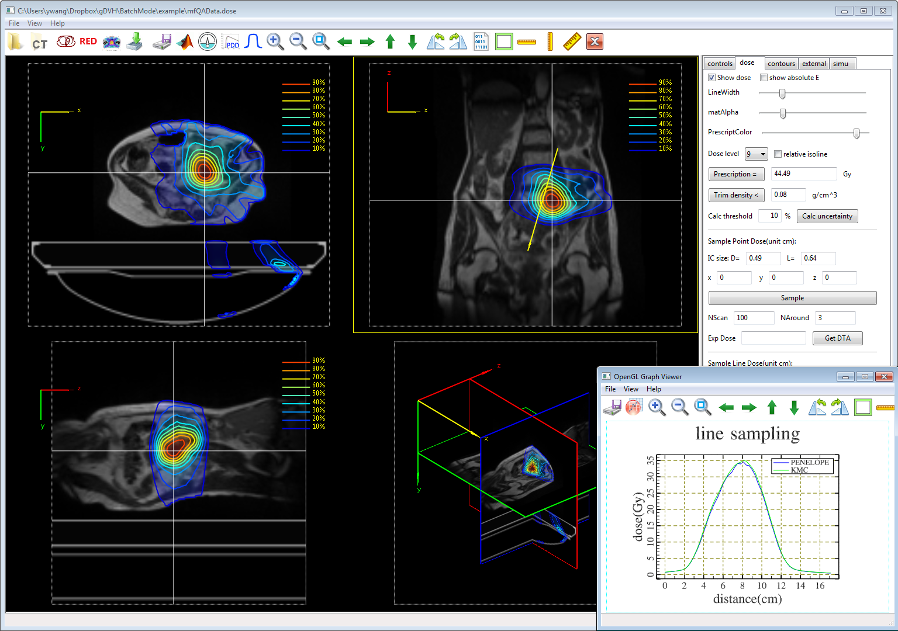

# BMC
GPU accelerated Monte Carlo simulation platform for Photon Therapy. It is the main research work for my PhD study in the Medical School of Washington University in St. Louis. BMC includes many tools to perform Monte Carlo simulations for photon therapy, mainly designed the ViewRay's MRIdian MRI-guided radiotherapy platform. The tools it includes usually run several times faster than ordinary CPU version. It can finish the simulations of real complex treatment plans in average 2 minutes. Several GUI tools are also provided to simplify user's operations.

# Dependency list:
- PINIT
- mathgl-2.3.2 
- dcmtk-3.6.1 
- zlib-1.2.11 
- szip-2.1.1 
- hdf5-1.8.19 
- matio-1.5.10

# Build guide:
- Download or git clone this BMC project
- Download or git clone my another porject named Dependencies, and place it in the same folder of BMC. It should look like this:

    MyProject
    
    |-BMC
    
    |-Dependencies

- Install the required tools for Windows or Linux platform (Linux have too many distributions, so you have to resolVe the dependencies by yourself!) 
1) Linux (Ubuntu 16.04.3 x64)
  - clang and config
        sudo apt install clang libomp-dev
        sudo update-alternatives --config c++
        sudo update-alternatives --config cc 
  - g++, gfortran
  - cmake
  - CUDA Toolkit 8 or 9 (8 tested on 14.04, 9 tested on 16.04)
    - first install the appropriate Nvidia driver(CUDA 9 minimum 384.00), then install the run file (do not use deb package) with GPU driver unselected.
    - for opengl only, instill sudo apt install mesa-common-dev libglu1-mesa-dev freeglut3-dev

  - libgtk-3-dev
  - libmatio-dev
  - p7zip-full (for gMeshMM to call 7z) & curl (to send email when job is finished)
2) Linux (Fedora 26 no fully tested)
  - clang
  - gfortran
  - cmake
  - CUDA Toolkit 8 or 9 (9 tested on Federa 26)
    - Install Nvidia driver first, then install run file without GPU driver selected
    - For openGL, install mesa-libGLU mesa-libGLU-devel
  - gtk3-devel
  - matio-devel
  - p7zip + p7zip-plugins, curl 

  Windows (Win10 x64) (PINIT precompiled by ICC)
  - Visual Studio 2015/2017 professional
  - CUDA toolkit 8 (VS 2015) /9 (VS2017)
  - cmake (>= 3.8.2), add to %path%
  - MinGW gfortran x64 (PINIT.dll was precompiled by ICC. You can also use MinGW gfortran to regenerate it)
 - 7z.exe (for gMeshMM to call 7z) & trash.exe have been preincluded(for DoseViewer to call) & curl (to send email when job is finished)
 - If you are using VS 2017, you will run into problems compiling cuda programs. You can create a bin directory in C:\Program Files (x86)\Microsoft Visual Studio\2017\Professional\VC\, and create a symbol link named cl.exe in it pointing to C:\Program Files (x86)\Microsoft Visual Studio\2017\Professional\VC\Tools\MSVC\14.10.25017\bin\HostX64\x64\cl.exe

- Build command
   - For Windows, open the Visual studio promt(your may need to create it by yourself due to version and installation variance. please change working directory to BMC) in the folder BMC, and type in build.bat.
   - For Linux, open the terminal in the folder BMCm and type in ./build.sh (you may need to do chmod +x build.sh and Dependencies/wxWidgets-3.1/src/stc/gen_iface.py first)

# Run BMC
The executable files and running configurations are all in folder BMC/RunBMC

Since github restricts the largest uploading file to 100M, I have to compress ViewRayCo.phsp by 7zip.

You should extract it by 7zip and put it at the same place of ViewRayCo.7z before running BMC simulations.

In Windows, you should also run installDoseViewer.bat and installTetViewer.bat in RunBMC\Setup to setup necessary association and copy 7z.exe and trash.exe to parent directory

In both platform, the folder RunBMC is portable. You can move it to wherever you want.

# Disclaim

BMC is maily develeped on Windows platform, and Linux platform hasn't been thoroughly tested. Basically, most of the functions run OK. If you run into any bug, please report to yuhewang.ustc@gmail.com

I will handle it as soon as possible. Thank you!

